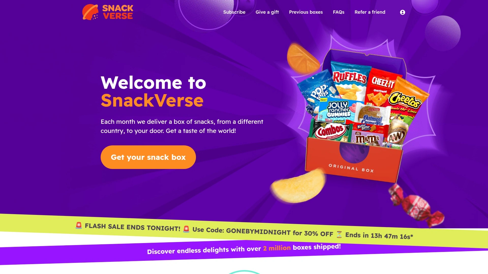

# Top 12 Best International Snack Subscription Boxes in 2025 (Recently Updated)

Scrolling through your pantry wondering why every snack looks exactly the same? International snack subscription boxes flip the script on boring munchies, delivering authentic treats from countries you've never even pronounce correctly. Each month brings new flavors, textures, and packaging so weird you'll actually read the ingredients for once.

***

## **[Universal Yums](https://www.universalyums.com)**

The most budget-friendly way to taste authentic snacks from different countries every month without overpaying.

Universal Yums nails the sweet spot between affordability and authenticity, sending snacks you genuinely can't find at your local grocery store. They source directly from local suppliers in each featured country, shipping fresh products that skip the typical import markup. You pick from three box sizes—Yum Box with 5-7 snacks starting at $16, Yum Yum Box with 12+ snacks starting at $26, or Super Yum Box with 18+ snacks plus a drink starting at $41.

Every delivery includes an illustrated booklet packed with trivia about the country, descriptions of each snack, and fun cultural facts that actually stick with you. Past boxes have featured strawberry jelly marshmallows from one country, spicy beef noodle popcorn from another, and ghostly ketchup potato crisps that sound ridiculous but taste incredible. You can choose your starting country when you subscribe, with options rotating between destinations like Ukraine, Spain, France, and South Korea.

The value breakdown is transparent—a $26 Yum Yum Box averages $1.53 per individually wrapped snack, which beats buying international items at specialty stores. Families especially love this box because kids get excited every month, and the cultural education element sneaks in learning while they're too busy snacking to notice. If you find favorites, their online shop lets you order more of specific products you tried in previous boxes.

***

## **[SnackCrate](https://www.snackcrate.com)**

Monthly boxes featuring full-size snacks from rotating countries with detailed cultural guides.

SnackCrate delivers a carefully curated mix of sweet and savory treats that represent the best of each featured country's snacking culture. Each box rotates to a new destination monthly, giving you a legitimate taste tour without repeating countries too quickly. The service focuses on full-size products rather than sample portions, so you get actual packages you'd find on shelves in that country.

What makes SnackCrate stand out is their commitment to authenticity—these aren't American versions of international flavors, they're the real products imported directly. The accompanying guide provides context about each snack's origin, ingredients, and cultural significance. This works perfectly for people who want to understand what they're eating, not just mindlessly munch through a box.

The subscription offers flexible delivery schedules and no-commitment cancellation options. You can pause shipments when traveling or adjust box sizes based on household needs. The packaging arrives sturdy enough to protect delicate items during shipping, and the unboxing experience feels genuinely exciting each month.

---

## **[Bokksu](https://bokksu.com)**

Premium Japanese snack subscription with 20+ items including authentic tea pairings and cultural depth.

Bokksu specializes exclusively in Japanese snacks, partnering with family-run makers across Japan who've perfected their craft over generations. Each Classic Bokksu box contains 21-22 authentic items including seasonal snacks, candies, and a curated tea pairing. The boxes follow thematic concepts tied to Japanese seasons, festivals, or regional specialties, making every delivery feel intentional rather than random.

The included culture guide is genuinely impressive—a full 24-page magazine with ingredient descriptions, common allergens, and stories about the artisans who created each product. You won't find any of these snacks at your local Asian grocery store because Bokksu sources exclusive items from smaller producers. The price point sits around $50 monthly for the one-month plan, with discounts for longer commitments.

Subscribers report that the quality justifies the cost, especially considering you're getting items shipped directly from Japan that would be impossible to source individually. The subscription works best for people who appreciate Japanese culture beyond just anime, offering deeper exploration of regional traditions and seasonal celebrations through food. Multi-month plans add bonus snacks to your first box as a welcome gift.

***

## **[TokyoTreat](https://tokyotreat.com)**

Japanese candy and snack boxes featuring exclusive DIY kits, drinks, and trending Tokyo treats.

TokyoTreat focuses on the fun, trendy side of Japanese snacking, including limited-edition seasonal releases and viral products popular in Tokyo right now. Each box contains 12-17 full-sized items depending on your subscription tier, always including at least one DIY candy kit that lets you assemble your own treats. The drink selection rotates monthly, featuring unique Japanese sodas and beverages you'd never find stateside.

The service includes a detailed candy guidebook explaining each product's flavor profile, ingredients, and cultural context. Prices start at $32.50 monthly, positioning this as an accessible entry point into Japanese snacking culture. What makes TokyoTreat different from other Japanese boxes is their focus on contemporary, Instagram-worthy products rather than traditional artisanal items.

TokyoTreat particularly appeals to anime fans and younger snackers who want to try the same products they see in Japanese convenience store haul videos. The DIY element adds interactive fun that works great for families or friend groups. Worldwide shipping is available, making this accessible regardless of location.

***

## **[Sakuraco](https://sakura.co)**

Artisanal Japanese snacks with authentic homeware items and support for local family makers.

Sakuraco delivers 20 authentic Japanese snacks plus tea each month, but the real differentiator is the included Japanese homeware piece—ceramic cups, dishes, chopsticks, or furoshiki wrapping cloths. Every item comes from local Japanese makers, many of them family-owned businesses that have operated for decades. The subscription actively supports small artisans rather than mass-market manufacturers.

Each box follows a specific theme based on seasons, holidays, or Japanese regions, with every detail meticulously planned around that concept. The 24-page full-color guide dives deep into the cultural significance of items, featuring stories about the artisans and their craft. Pricing ranges from $37.50 for one month down to $32.50 per box on annual plans.

The homeware pieces accumulate into a genuine collection over time—after a year you'll have an impressive array of authentic Japanese tableware. The box itself is gorgeous with color and gold foil details, making it worth keeping for storage. Sakuraco works perfectly for people who view snacking as a cultural experience rather than just eating. Shipping comes directly from Japan with worldwide delivery available.

***

## **[Try The World](https://trytheworld.com)**

Chef-curated gourmet foods from different countries monthly with recipes and cultural exploration.

Try The World takes a more sophisticated approach to international snacking, featuring chef-selected artisan products rather than typical convenience store fare. Each box contains 12+ delicious snacks and treats from various countries, including dried meats from Spain, French sweets, Korean candy, and beyond. Prices start at $33 monthly, positioning this as a premium but accessible option.

The service collaborates with cuisine experts to curate authentic, high-quality products that represent the best of each region. You get an assortment of unique items that lean more gourmet than playful—think artisanal crackers, specialty chocolates, and cooking ingredients. Each delivery includes a culture guide and recipes showing how to use the products.

Try The World offers separate subscription lines including a dedicated Snacks box for $19 monthly and a Pantry box for $29.95 focused on cooking ingredients. The bimonthly delivery schedule gives you time to actually enjoy each box before the next arrives. This works best for foodies who want to cook with international ingredients, not just snack mindlessly.

---

## **[Munch Addict](https://munchaddict.com)**

Exotic international snacks with bulk purchase options ranging from 5 to 72 snacks per order.

Munch Addict offers the most flexible sizing in the industry, letting you order anywhere from 5 snacks up to 72 items in a single delivery. They run two subscription lines—Munch Box with assorted international snacks and Korea Box featuring exclusively South Korean treats. The ability to stockpile treats makes this perfect for offices, events, or serious snack hoarders.

Both box types let you add an optional international drink to complete the experience. The Korea Box specifically appeals to K-pop and K-drama fans who want to try snacks they see in their favorite shows. Pricing starts at just $15, making this one of the most budget-friendly options available.

The service emphasizes variety and discovery, rotating products frequently so repeat subscribers don't get bored. Munch Addict ships worldwide with free delivery included, removing the surprise costs that plague some international subscription services. The bulk-size option is genuinely unique—no other service lets you order 72 snacks in one go.

---

## **[SnackVerse](https://snackverse.com)**

Monthly snacks from different countries with a 20-page themed guide and total subscription flexibility.

SnackVerse delivers 10+ full-size snacks from a rotating country each month, with premium boxes including 20+ items. The service includes a detailed 20-page guide exploring the country's culture and explaining each snack's background. Pricing starts remarkably low at $7.99 monthly, making this the most accessible option for budget-conscious snackers.

Every box contains a varied selection of sweets, chocolates, crisps, biscuits, and drinks representing the featured destination. The no-commitment cancellation policy means you can stop anytime from your account settings without questions or fees. Free shipping on UK orders makes this especially attractive for European customers, with international rates varying by location.

The 100% satisfaction guarantee backs up their quality claims—they genuinely curate the best snacks from each country. You can choose between mini, original, or premium box sizes depending on your household needs. Deliveries typically arrive near month-end, giving you something to look forward to as a monthly treat.

---

## **[Treats](https://www.trytreats.com)**

Snacks from around the world delivered monthly with plans starting at an incredibly affordable $13.95.

Treats focuses on making international snacking accessible to everyone with entry-level pricing that doesn't sacrifice quality. The food subscription model delivers snacks from different countries each month straight to your door. Plans start at $13.95, undercutting most competitors while still providing authentic products.

The service positions itself as a discovery tool for exploring world cultures through food, making it perfect for curious eaters on tight budgets. Treats works particularly well as an ongoing gift subscription for college students, deployed military, or anyone who appreciates trying new flavors. The straightforward approach eliminates complicated tier systems—you pick a plan size and start receiving boxes.

What Treats lacks in fancy packaging or extensive guides, it makes up for with pure value and product variety. The monthly rotation keeps things fresh without overwhelming you with too many choices upfront. This service thrives on simplicity and affordability rather than premium positioning.

---

## **[Yummy Bazaar](https://yummybazaar.com)**

Gourmet international foods with themed boxes from specific regions or a rotating world selection.

Yummy Bazaar delivers 6-8 authentic full-size items monthly, distinguishing itself through premium gourmet positioning. You can choose between themed boxes focusing on Italy, France, Asia, a rotating World Box, or even a charcuterie selection. Pricing sits at $69 per shipment, reflecting the upscale product selection.

The service emphasizes cooking ingredients and artisanal specialty foods alongside traditional snacks. Past boxes have included items like Olasagasti black olive paste from Spain, truffle pasta from Italy, and trending Asian bubble tea ingredients. Your subscription earns points redeemable on the Yummy Bazaar website for purchasing more of your favorite discoveries.

Yummy Bazaar targets food enthusiasts who want restaurant-quality ingredients delivered monthly. The boxes work beautifully for adventurous home cooks looking to experiment with authentic international flavors. Shipments arrive between the 15th and 20th of each month with 2-4 business day delivery. You can request temporary holds when traveling or unavailable to receive deliveries.

---

## **[KoreaCrate](https://koreacrate.com)**

Korean snacks delivered directly from Seoul with authentic products and K-culture immersion.

KoreaCrate specializes exclusively in South Korean treats, shipping directly from Seoul to maintain maximum freshness and authenticity. The service taps into the massive popularity of Korean pop culture, letting fans try the same snacks they see in dramas and variety shows. Pricing and sizing details require checking their current offerings directly.

Korean snacks offer wildly different flavor profiles than Western treats—you'll encounter everything from sweet Pepero sticks to adventurous squid-flavored options. KoreaCrate works perfectly for K-pop enthusiasts, Korean language learners, or anyone curious about Korean food culture beyond restaurant dishes. The direct-from-Seoul shipping ensures you're getting current trending products rather than items that have sat in warehouses.

This subscription makes sense if you want deep exploration of one specific country's snacking culture rather than rotating international variety. The Korean market is massive and diverse enough to support months of discovery without repetition.

***

## **[CraveBox](https://cravebox.com)**

Online snack box delivery service offering gifts and curated selections for various occasions.

CraveBox provides snack box delivery with emphasis on gifting and special occasions beyond standard monthly subscriptions. The service offers curated selections perfect for corporate gifts, care packages, or celebratory treats. Their online ordering system simplifies the process of sending snack boxes to multiple recipients.

CraveBox works well when you need reliable snack delivery for offices, events, or thoughtful gifts rather than personal monthly indulgence. The flexibility in ordering one-time boxes versus recurring subscriptions gives you control over commitment levels. This option suits people who want snack box convenience without locking into long-term subscriptions.

---

## FAQ

**How do international snack boxes handle shipping perishable items across borders?**

Most services use expedited shipping with protective packaging like insulated boxes and temperature controls to maintain freshness. Items are typically shipped within days of packing, and subscriptions use flash-freezing or air-tight sealing when necessary. Delivery windows range from 2-4 business days domestically, with international shipping taking slightly longer but still prioritizing quick transit.

**Can I actually customize what snacks I receive or am I stuck with whatever they send?**

The majority of international snack subscriptions are curated selections without customization—part of the adventure is trying unexpected items. However, you can typically choose box sizes, select starting countries, or pick themed collections like vegan or gluten-free options where available. Some services like Universal Yums let you select your first box's country destination when subscribing.

**What happens if I hate most of the snacks in my box?**

Many services offer satisfaction guarantees or first-box refunds if you're genuinely disappointed. The cultural guides help set expectations by describing flavors beforehand, reducing unwelcome surprises. Most subscribers find that trying unfamiliar flavors becomes part of the fun rather than a problem—your palate typically adapts and expands over time.

***

## Conclusion

International snack boxes transform monthly deliveries into passport stamps for your taste buds without airport security or jet lag. Whether you want budget-friendly global variety or deep cultural exploration of one country's treats, these subscriptions make it ridiculously easy to escape snack boredom. [Universal Yums](https://www.universalyums.com) delivers the best value for families and curious eaters who want authentic international snacks without premium pricing—making world travel deliciously affordable one box at a time.
